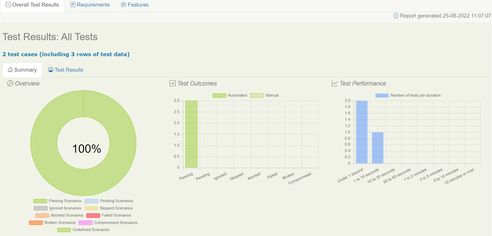
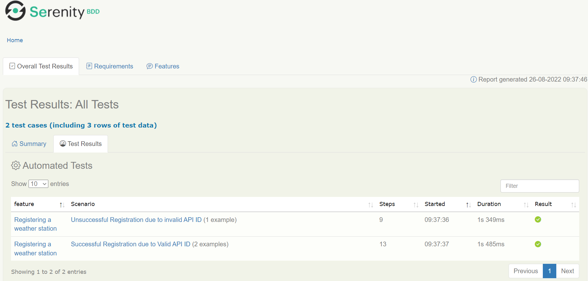
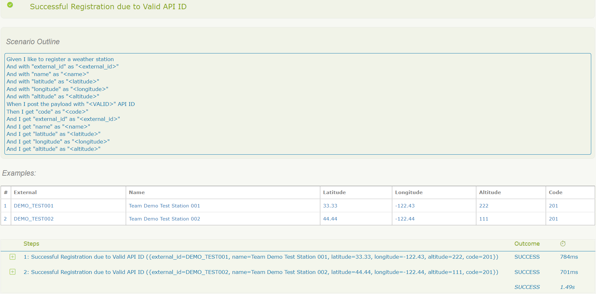
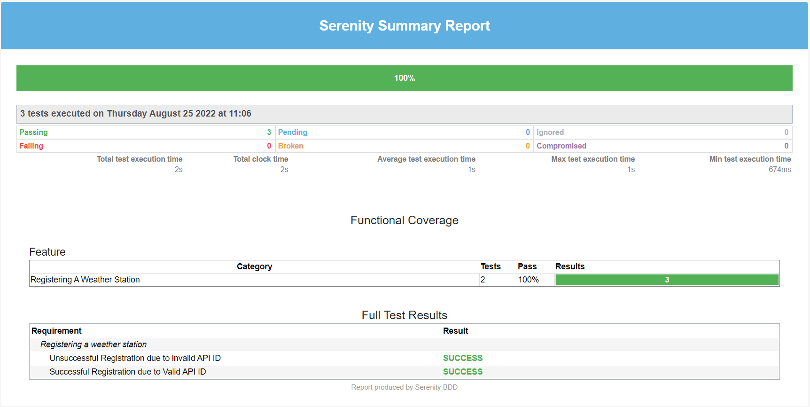

# API Testing using Java/Serenity/BDD Framework

To test registering a station to weather map

### Prerequisites to run test
* Install Java JDK 8
* Install Gradle 7.2 (Optional)
* Run java -version and gradle -version to see if it is set to right version
* Set Paths if command not found

### How to run test
* Go to project root directory and run following. (either ./gradlew or gradlew.bat)
* ./gradlew clean test aggregate reports "-Dopenweathermap.api_id=<API_ID>"                                    // To run all test
* ./gradlew clean test aggregate reports "-Dopenweathermap.api_id=<API_ID>" "-Dcucumber.filter.tags=@positive" // To run specific test

### Continuous Testing Pipeline
* Azure : Use azure-testing_pipelines.yml to create pipeline and run test
* AWS   : Use aws_cloudformation_testing.template to create pipeline and run test

### Test report
* Refer to  <project root>/target/site/serenity/index.html            - For Detailed report

* Refer to  <project root>/target/site/serenity/serenity-summary.html - For Single Page report

